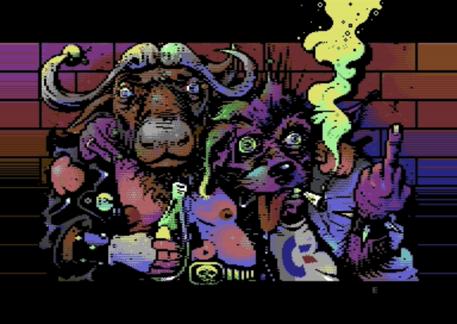

# C64 Layered Images

A collection of layered C64 images, with metadata and artwork breakdowns.

## C64 Layered Image Format

The Layered C64 Image Format describes how a C64 artwork is assembled. It records layers, interlaced phase groups, hardware sprites, border-raster colors, and animation timing so the image can be reconstructed, taken apart, and studied.

### Motivation

The format was created to make it easy to define complex C64 artworks as a set of parts that can be broken down and explained. C64 Graphics Explorer is the first application to implement this specification. We encourage anyone creating C64 artwork to publish it as a layered image, so others can study how it was made.

*Scene Farts by Electric shows excellent craftsmanship: a phase-shifted sprite carpet overlaid on a high-resolution 320x200 bitmap image. Output rendered by C64 Graphics Explorer.*

The full [C64 Layered Image Format specification](SPEC.md) lives in this repository. Each folder in `images/` is a self-contained image package written against it. It contains a `manifest.json`, the PNG assets named by that manifest, and a `preview.jpg` showing the artwork's default composition.

This is the canonical collection source. C64 Graphics Explorer may import selected folders into its bundled gallery, but the application does not define the collection.

Each image credits its author and, where known, links to its original CSDb release. Artwork is included in good faith for preservation, study, and appreciation; ownership remains with its original authors and rights holders.

## Contributing

Read [CONTRIBUTING.md](CONTRIBUTING.md) before opening a pull request.

## License

The format specification is MIT. Artwork files remain the property of their respective authors unless their folder says otherwise.
